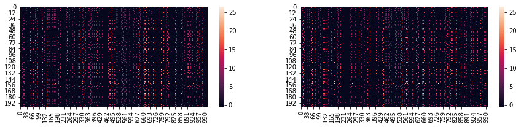
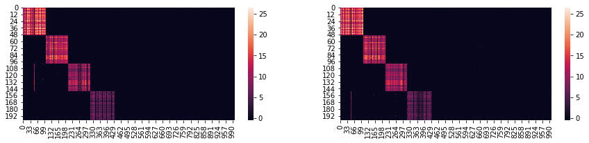

**iSSVD** is the algorithm developed for 'Robust Intergrative Biclustering for Multi-view Data'. It is based on sparse singular value decompostion (Lee et al. 2010) and stability selection (Meinshausen and Bühlmann, 2010 and Sill et al., 2011).

This is a simple guide to show how to use the python package 'iSSVD' (Weijie Zhang and Sandra E. Safo. "Robust Integrative Biclustering for Multi-view Data." *Bioinformatics* submitted, 2020).


```python
import pandas as pd
import numpy as np
from iSSVD.functions import issvd, issvd_diagnostics, gen_sim_vec, gen_tmp
from numpy.random import seed
```

First generate example data. Here we generate one group of data that contains two views, each has dimension $200\times1,000$. We have four artificical biclusters in the data while each biclsuter contains $50$ samples and $100+100$ (100 for each view) variables. There is no overlaps between biclsuters. The noise level $\sigma$ is 0.1.


```python
seed(25)
data, rows, cols = gen_sim_vec(n=200,p=1000,D=2,rowsize=50, colsize=100, 
                               numbers=1,sigma=0.1,nbicluster=4, orthonm=False)

df = data[0]
```

Then we run iSSVD.


```python
res = issvd(X=df,standr=False,pointwise=True,steps=100,size=0.5,
            vthr = 0.9,ssthr=[0.6,0.65],nbicluster=10,rows_nc=False,cols_nc=False,col_overlap=False
            ,row_overlap=False,pceru=0.1,pcerv=0.1,merr=0.0001,iters=100)
```

    Bicluster 1...
    
    
    Bicluster 2...
    
    
    Bicluster 3...
    
    
    Bicluster 4...
    
    
    All samples are clustered!
    Integrative biclusters detected: 4
    
    

We compare the biclusters with the original ones. The intermediate step is to convert the true biclsuter indices to the format identified by the diagnostic function.


```python
# Bicluster samples identified by iSSVD
Rows = res['Sample_index']
# Bicluster variables identified by iSSVD
Cols = res['Variable_index']

# True bicluster samples and variables
row_ind = rows[0]
col_ind = cols[0]

res1tmp, res2tmp = gen_tmp(Rows,Cols, row_ind, col_ind,n=200,p=1000,D=2)

rev, rel, f, fp, fn = issvd_diagnostics(res1tmp,res2tmp,row_ind,col_ind)
```


```python
print(f"Average Revovery is {rev.round(4)}.")
```

    Average Revovery is 0.935.
    


```python
print(f"Average Relevance is {rel.round(4)}.")
```

    Average Relevance is 0.935.
    


```python
print(f"F-score is {f.round(4)}.")
```

    F-score is 0.935.
    


```python
print(f"False positive rate is {fp.round(4)}.")
```

    False positive rate is 0.055.
    


```python
print(f"False negative rate is {fn.round(4)}.")
```

    False negative rate is 0.0138.
    

Next, we visualize the biclusters.


```python
import seaborn as sns
import matplotlib.pyplot as plt
```


```python
# Before clustered
fig, axes = plt.subplots(nrows=1, ncols=2, figsize=(15,3))

sns.heatmap(df[0],ax=axes[0])
sns.heatmap(df[0],ax=axes[1])
```


    <matplotlib.axes._subplots.AxesSubplot at 0x25c5ef9cf28>





```python
# After Clustered

new_df = []
for d in range(2):
    cs = []
    d=0
    col = np.array([],dtype=int)
    for i in range(4):
        r1 = df[d][Rows[i],:]
        col = np.append(col,Cols[i][d])
        c1 = r1[:,col]
        c2 = np.delete(r1, col, axis=1)
        c3 = np.concatenate([c1,c2], axis=1)
        cs.append(c3)
    new_df.append(np.vstack(cs))
    
fign, axesn = plt.subplots(nrows=1, ncols=2, figsize=(15,3))
sns.heatmap(new_df[0],ax=axesn[0])
sns.heatmap(new_df[0],ax=axesn[1])
```


    <matplotlib.axes._subplots.AxesSubplot at 0x25c5f8b8080>





